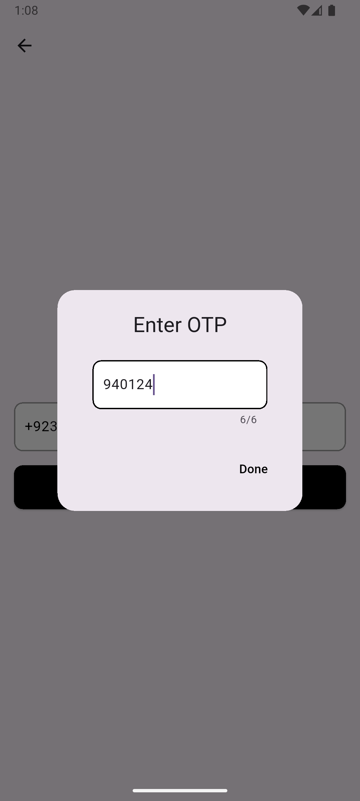

# Firebase Auth App 🔐

A simple Flutter application demonstrating Firebase Authentication integration with multiple sign-in methods.

## Features ✨
- 🔑 Email & Password Authentication
- 📞 Phone Number Authentication
- 🟢 Google Sign-In
- 👻 Anonymous Sign-In
- 🔁 Email Verification
- 🔐 Forgot Password
- 📝 Login / Signup Screens
- ✅ Auth State Persistence

## Screenshots 📸

### **Firebase Sign In Providers**
> Firebase console configuration showing the enabled authentication providers used in the app (Email/Password, Phone, Google, Anonymous).
<p>

<p>

### **Sign In Page**
> The main login screen where users can enter their email and password to sign in, or navigate to other sign-in options like Google or Phone.
<p>

<p>

### **Signing Up & Verification**
> Screens demonstrating user registration and the email verification flow. After signing up, the user receives a verification email and must confirm their address before accessing the app.
<p>


<p>

### **Phone Sign In**
> A complete flow for authenticating using a phone number. Includes inputting the number, receiving an OTP, entering it, and verifying the user.
<p>





<p>

### **Anonymous Sign In**
> Screens showing how users can quickly enter the app anonymously without providing any credentials, ideal for guest sessions or quick trials.
<p>


<p>

### **Google Sign In**
> Demonstrates the Google authentication process where users select a Google account and are automatically signed into the app
<p>


<p>

### **Resetting Password**
> Screens demonstrating the password reset flow. Users can enter their registered email address to receive a reset link. After clicking the link from their inbox, they are directed to a page where they can set a new password and regain access to their account.
<p>


<p>

## Dependencies ⚙️
This project uses the following dependencies:

- [`firebase_core`](https://pub.dev/packages/firebase_core): Required for initializing Firebase in your Flutter app.
- [`firebase_auth`](https://pub.dev/packages/firebase_auth): Firebase Authentication SDK to implement various sign-in methods.
- [`google_sign_in`](https://pub.dev/packages/google_sign_in): Enables Google Sign-In authentication.
- [`flutter_dotenv`](https://pub.dev/packages/flutter_dotenv): Used to load environment variables from a `.env` file.

## Getting Started 🛠️

### Prerequisites

- Flutter SDK (>=3.0.0)
- Dart SDK
- Firebase project setup

### Firebase Setup 🔧 

1. Create a Firebase project at [https://console.firebase.google.com](https://console.firebase.google.com)
2. Add an Android/iOS app to the project.
3. Download `google-services.json` (Android) or `GoogleService-Info.plist` (iOS) and place it in the appropriate directory.
4. Enable the following sign-in providers in Firebase Authentication:
   - Email/Password
   - Phone
   - Google
   - Anonymous

### Installation 📦

Clone the repository and run the following commands:

```bash
git clone https://github.com/muhammadXainAhmad/firebase_auth_app_flutter.git
cd firebase_auth_app_flutter
flutter pub get
flutter run
```

## Tech Stack 🛠️

- **Flutter**: UI toolkit for building natively compiled applications for mobile from a single codebase.
- **Dart**: The programming language used to develop Flutter applications.
- **Firebase Auth**: Provides backend services for easy use of authentication with multiple methods.
- **Google Sign-In**: Enables users to sign in with their Google accounts.
- **Flutter Dotenv**: Manages environment variables securely.
- **VS Code / Android Studio**: IDEs used for Flutter development.
- **Git**: Version control system for tracking changes in source code.

## License 📄
This project is licensed under the [MIT License](LICENSE).